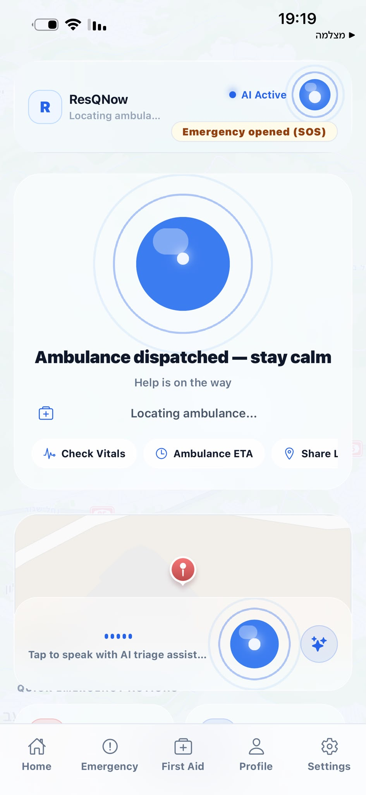
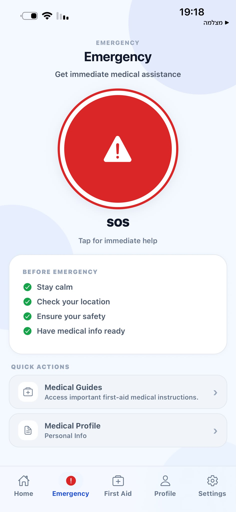
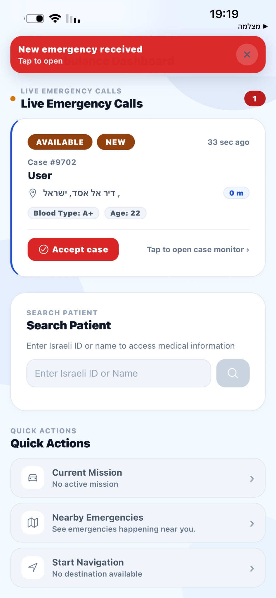
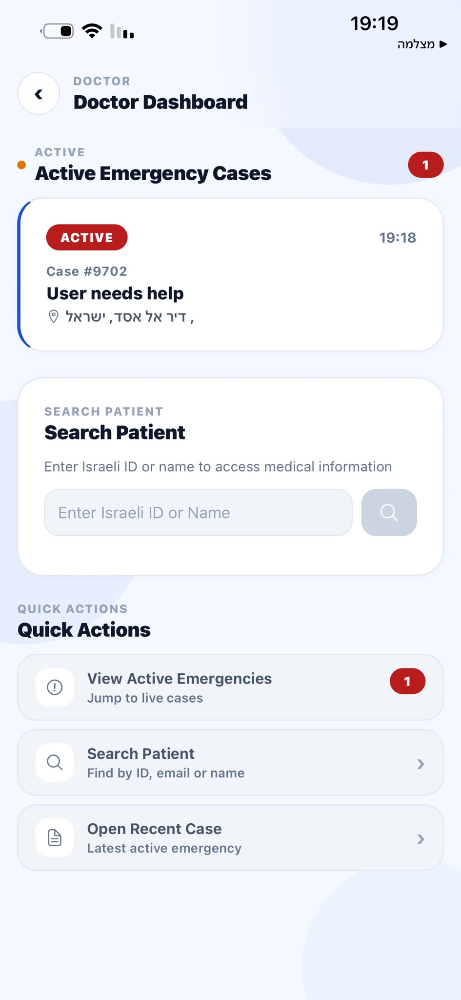

# 🚑 ResQNow

### Real-Time Emergency Response & First Aid Platform

ResQNow is a mobile emergency assistance platform built with **React Native**, **Expo**, and **Firebase**. The application helps users quickly request emergency assistance, share critical medical information, access first-aid guidance, and connect with emergency responders in real time.

---

## 📱 Overview

ResQNow was developed to improve emergency response workflows by providing a structured communication channel between patients, ambulance teams, and medical personnel.

The platform combines real-time emergency management, medical profiles, location tracking, and first-aid resources into a single mobile application.

---

## ✨ Features

### 🆘 Emergency SOS System

* One-tap emergency activation
* Support for emergency requests for:

  * Yourself
  * Someone else
* Real-time emergency session tracking
* Live emergency status updates
* Emergency history logging

### 📍 Live Location Sharing

* Real-time GPS tracking
* Location updates for responders
* Route navigation support
* Distance and ETA calculations

### 🚑 Ambulance Dashboard

* View active emergency cases
* Accept emergency assignments
* Navigate directly to patient locations
* Manage emergency status transitions:

  * Dispatched
  * Accepted
  * En Route to Scene
  * Arrived
  * Transporting
  * Completed

### 👨‍⚕️ Doctor Dashboard

* Review active emergency cases
* Access patient medical information
* Monitor incident progress
* Support emergency response workflows

### 🤖 AI Emergency Assistant

* AI-powered emergency guidance
* First-aid recommendations
* Context-aware emergency assistance

### 📚 First Aid Library

* CPR guidance
* Choking response
* Bleeding control
* Burns treatment
* Fracture management
* Emergency medical procedures

### 👤 Medical Profile Management

Store important medical information:

* Blood type
* Allergies
* Chronic conditions
* Current medications
* Emergency contacts
* Medical history

### 🌐 Multilingual Support

* English
* Arabic
* RTL support

### 🔒 Security

* Firebase Authentication
* Firestore Security Rules
* Role-based access control
* Protected emergency workflows

---

## 📊 Project Highlights

* 4 User Roles (Patient, Ambulance Team, Doctor, Administrator)
* 20+ Mobile Screens
* Real-Time Emergency Workflow
* Firebase Authentication Integration
* Firestore Cloud Database
* GPS-Based Location Tracking
* Multi-Language Support

---

## 🏗️ Tech Stack

### Frontend

* React Native
* Expo
* TypeScript
* Expo Router
* React Native Reanimated

### Backend

* Firebase Authentication
* Cloud Firestore
* Firebase Storage

### Maps & Location

* React Native Maps
* Expo Location

### AI Integration

* OpenAI API

---

## 📸 Screenshots

### Patient Dashboard



### Emergency Request Flow



### Ambulance Dashboard



### Doctor Dashboard


---

## 🔄 Emergency Workflow

```text
SOS Trigger
      ↓
Location Verification
      ↓
Create Emergency Session
      ↓
Assign Ambulance
      ↓
Accepted
      ↓
En Route To Scene
      ↓
Arrived
      ↓
Transporting
      ↓
Completed
```

---

## 📂 Project Structure

```text
app/
├── auth/
├── (tabs)/
├── admin/
├── doctor/
├── ambulance/

src/
├── context/
├── services/
├── emergency/
├── hooks/
├── firebase/
├── ui/
├── utils/

components/
├── ai-emergency/
├── first-aid/
├── ui/
```

---

## 🚀 Installation

### Clone Repository

```bash
git clone https://github.com/Alihaib/ResQNow.git
cd ResQNow
```

### Install Dependencies

```bash
npm install
```

### Configure Environment Variables

Create a `.env` file:

```env
OPENAI_API_KEY=YOUR_API_KEY
```

Configure Firebase inside:

```text
src/firebase/config.ts
```

### Run Development Server

```bash
npx expo start
```

### Android

```bash
npx expo run:android
```

### iOS

```bash
npx expo run:ios
```

---

## 🎯 Learning Outcomes

This project strengthened practical experience in:

* Mobile Application Development
* React Native & Expo
* Firebase Integration
* Real-Time Data Management
* Authentication & Authorization
* GPS & Location Services
* Software Architecture
* UI/UX Design

---

## 🔮 Future Improvements

* Push notifications
* Voice emergency activation
* Wearable device integration
* Hospital system integration
* Offline emergency mode
* Advanced responder analytics
* AI triage recommendations
* Multi-region emergency support

---

## 📄 License

This project was developed for educational and portfolio purposes.

---

## 👨‍💻 Author

**Hasan Mosa**

Software Engineering Student

GitHub: https://github.com/HasanMosa12

LinkedIn: https://linkedin.com/in/hasan-mosa-143b85317

---

Built with ❤️ to improve emergency response and save lives.
